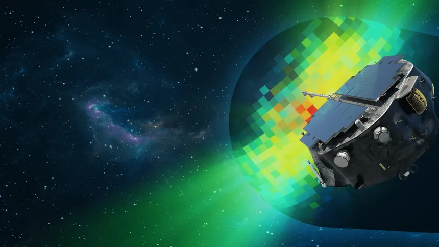

# ★ StarDriftOS — your orbit, in a browser.

> A personal webOS with mission-control vibes. Boot sequence, orbital clock, window manager + 7 apps — all in **one HTML file**. No frameworks, no build step.


### 🚀 Live Demo

**→ https://dxkshh-codee.github.io/StarDriftOS/**

> If Pages isn't enabled yet: `Settings → Pages → Source: Deploy from a branch → Branch: main / (root) → Save` — live in ~1 min.

<p align="center">
  
</p>

---

## ✨ What it is

StarDriftOS is two experiences in one page:

**1. Landing Orbit** — cinematic hero with typing boot line (`INITIALIZING STARDRIFTOS...`), drifting satellite, telemetry ticker, status window, and a live starfield/grid. Pure CSS atmosphere.

**2. Desktop OS** — click **enter my os** → 5-second loading sequence → full desktop with taskbar, draggable windows, orbital clock + mini-calendar, live wallpapers, and apps. Includes an easter-egg: chase the satellite cursor and click to `BOOM 💥`.

Built for the **Stardance Challenge** — one file, infinitely poke-able.

## 🛰️ Apps

| App | `id` | What it does |
|-----|------|--------------|
| **Browser** `browser.exe` | `browserWindow` | Embedded Wikipedia (random article) with fallback link — draggable, minimizable, maximizable |
| **Calculator** `calc.exe` | `calculatorWindow` | Full grid calc with `C / ⌫ / % / ÷ × − +`, keyboard support, safe eval |
| **Camera** `camera.exe` | `cameraWindow` | `getUserMedia` live preview + capture/retake (needs `https` or `localhost`) |
| **Hubble** `hubble.exe` | `galleryWindow` | 6-image gallery from `./hubble/` (M3, NGC 6723/6426/4654, LMC-L95, STScI) — grid → detail view |
| **Notes** `notes.exe` | `notesWindow` | Auto-saving textarea → `localStorage: stardrift-notes` + live word count |
| **Terminal** `terminal.exe` | `terminalWindow` | `drift-sh v1.0` with history (↑/↓), `open/close`, `wallpaper`, `neofetch`, etc. |
| **Snake** `snake.exe` | `gameWindow` | Canvas snake (20×20, 15px cells), score/best (`localStorage: stardrift-snake-best`), WASD/arrows/space |

Plus: **Settings** `settings.exe` — 10 live wallpapers.

## 🪟 Window Manager

Every app is a real OS window (`D:\Projects\StarDriftOS\StarDriftOS.html:1221`):

- **Drag** by titlebar (pointer capture, clamped to viewport)
- **Focus** → raises `z-index`, glow ring
- **Minimize / Maximize / Restore / Close** — maximize saves/restores geometry (`_windowRestore`)
- **Taskbar** dots + `active-app` highlight, orbital status (`DESKTOP` / app name), Wi-Fi + volume, `← back to orbit` to exit desktop

## 🎨 Wallpapers & Atmosphere

`Settings → Choose your orbit` — persisted in `localStorage: stardrift-wallpaper`:

`Solid`: `void` `#070b16`, `graphite`, `midnight`, `forest`, `plum` → flat matte
`Glossy`: `black` / `cyan` / `purple` / `red` / `ocean` glass — radial glows + linear gradients

Desktop also renders **150 twinkling stars + 11 satellites + 20 asteroids + 55 dust particles + 2 planet orbs** via `makeWallpaperObjects()` (`StarDriftOS.html:1825`) — all CSS-animated drift orbits.

## 🧭 Orbital HUD

- **Orbital Clock** — `TIME.EXE // LOCAL` with `HH:MM:SS`, full date, rotating `vibe` (`StarDriftOS.html:2022`), live dot pulse
- **Mini Calendar** — month grid (`calendarGrid`), today highlighted
- **Top Status** — `SYSTEM ONLINE`, `ORBIT: STARDRIFTOS`, live `HH:MM:SS LOCAL`
- **Uptime** — `status.exe` window (`uptimeVal`)

## 🛠️ Tech

- **Single file:** `index.html` (~3.5k lines) — HTML + `<style>` + `<script>`, zero deps
- **Fonts:** `Space Grotesk` / `JetBrains Mono` / `Inter` via Google Fonts
- **Storage:** `localStorage` for wallpaper, notes, snake best
- **No build:** open the file and it runs

## 📦 Quick Start

```bash
# clone
git clone https://github.com/Dxkshh-Codee/StarDriftOS.git
cd StarDriftOS

# run — just open it
start index.html        # Windows
open index.html         # macOS
xdg-open index.html     # Linux
# or serve: npx serve .  → http://localhost:3000
```

## 📁 Structure

```
StarDriftOS/
├── index.html          # ← the whole OS (deploy this)
├── StarDriftOS.html    # source copy (kept in sync)
├── satellite.png       # hero + avatar image
├── pfp.webp
└── hubble/             # hubble.exe gallery
    ├── M3.jpg
    ├── NGC6723.jpg
    ├── NGC6426.jpg
    ├── NGC4654.jpg
    ├── LMC-L95.jpg
    └── STScI-object.jpg
```

## 🎛️ Customize (fast edit tags)

Search `index.html` for these:

| Tag | What to change |
|-----|----------------|
| `[EDIT: NAME]` | your handle (hero `Dxkshh`) |
| `[EDIT: TAGLINE]` | header line |
| `[EDIT: BIO]` | `bio` paragraph |
| `[EDIT: LINKS]` | `enter my os` + GitHub/social links |
| `[EDIT: TICKER]` | `facts[]` array (`StarDriftOS.html:2043`) — loops forever |
| `[EDIT: IMAGE]` | swap `satellite.png` |
| `[EDIT: GALLERY]` | `HUBBLE_PHOTOS[]` (`StarDriftOS.html:2598`) — add/remove photos |

Ticker + gallery are just JS arrays — edit and reload.

## 💻 Terminal Commands

```
help              show list
about             what is StarDriftOS
apps              list installed apps
open <app>        launch: browser calc camera hubble notes snake settings
close <app>       close one (or terminal)
wallpaper [name]  list or set: solid-void, solid-graphite, solid-midnight, solid-forest, solid-plum, gloss-black, gloss-cyan, gloss-purple, gloss-red, gloss-ocean
neofetch          system info (uptime, res, wallpaper)
echo <text>       repeat
date / uptime / whoami / ship / sudo / clear / exit
```

History: `↑` / `↓` cycles.

## 🌍 Deploy — any browser, free

This is a **static site** → runs everywhere via **GitHub Pages**:

1. Push `index.html` to `main` (already done)
2. GitHub → `Settings → Pages → Build and deployment → Source: Deploy from a branch → Branch: main / (root) → Save`
3. Open `https://<you>.github.io/StarDriftOS/`

Works on desktop + mobile. Camera needs `https` (Pages gives it).

## 📄 License

MIT — do whatever, keep the satellite drifting.

---

<p align="center">
  <sub>built line by line, orbiting between code, playlists, and whatever hyperfixation i'm on this week.</sub><br/>
  <sub>— Dxkshh · StarDriftOS v1.0</sub>
</p>
